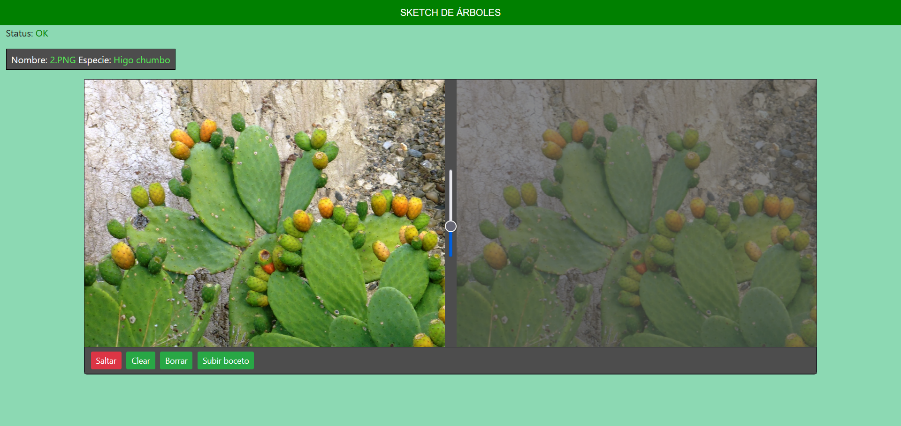
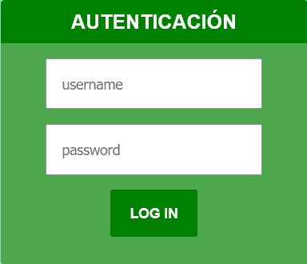
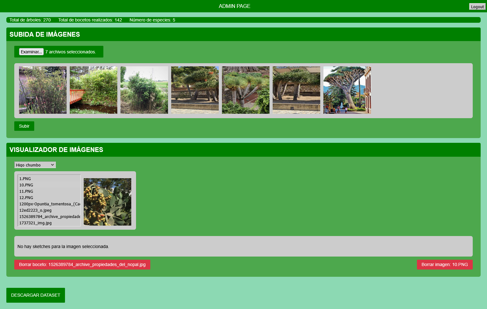

# Web de Bocetos

Desarrollada bajo NodeJS, la intención de esta web es la de permitir el desarrollo de un conjunto de datos supervisados de imágenes asociadas a bocetos. Para ello, en la web se muestra una imagen del servidor junto a una pizarra donde se ha de esbozar. 

## Puesta a punto

Como prerrequisito necesitamos disponer de una base de datos Mongo, con una colección llamada *users* que contenga al menos un documento con *username* y *password*. Este será el usuario administrador.

Para poner en funcionamiento la web debemos renombrar el fichero *.example.env* a *.env*.  Posteriormente, lo modificaremos, indicando la cadena de conexión al servidor de Mongo con el usuario administrador y la clave privada con la que se cifró la contraseña.

Creamos un directorio llamado images, donde se almacenarán las imágenes y los bocetos. Las imágenes ha esbozar se han de ubicar en el servidor del siguiente modo:

```bash
├── images
│   └── Plantas
│       ├── arbusto
│       │   ├── arbusto1.jpg
│       │   ├── arbusto2.jpg
│       │   └── arbusto3.jpg
│       ├── manzano
│       │   ├── manzano1.jpg
│       │   ├── manzano2.jpg
│       │   └── manzano3.jpg
│       └── pino
│           └── pino1.jpg

```

Con todo esto listo, sólo nos queda un único paso, que es el de instalar los módulos de node que han sido empleados, para ello:

```
npm install
```

Tras este último comando, todo está listo para poner en funcionamiento la web con:

```
npm start
```

## Interfaz

### Pantalla principal


### Cuadro de inicio de sesión
<p align="center">
 
</p>

### Cuadro de inicio de sesión

